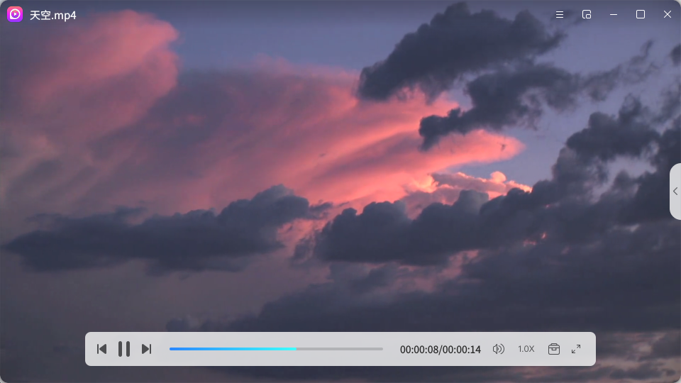
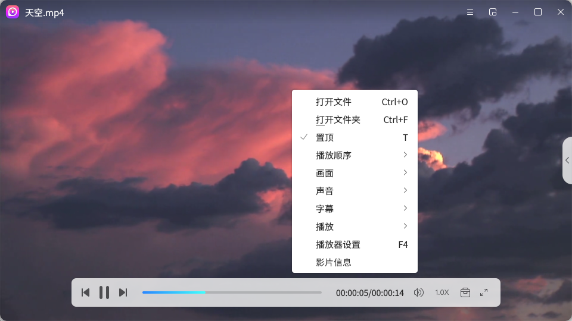
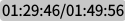
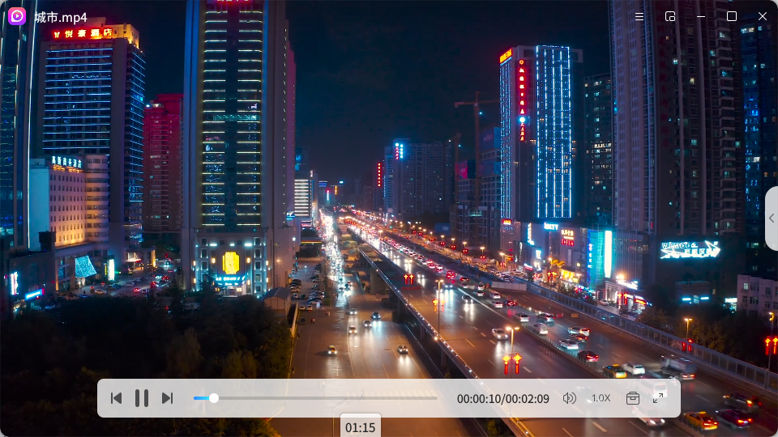
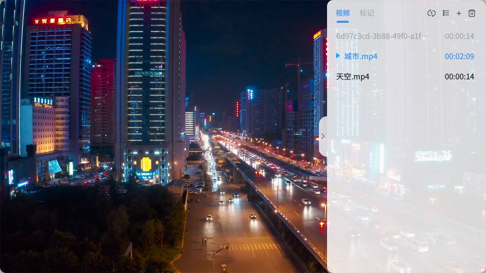
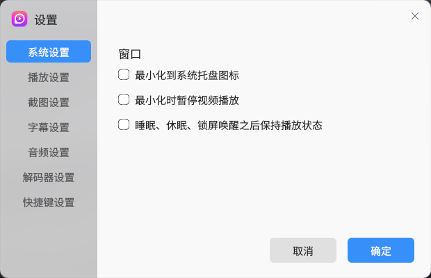

# 影音
## 概 述
影音是一款界面美观，互动性友好的音视频播放器，支持.mkv、.avi、.mp4、  .mp3、.wmv等主流音视频格式，具有强大的解码能力；功能齐全，支持播放顺序设置、屏幕截图、字幕载入、画面设置、添加文件书签、无痕播放等，还可以设
置迷你播放窗口以满足不同的播放需求。 

 

## 打开方式
● “开始菜单”>“影音”； 
● 选中视频文件 > 双击 > 默认打开“影音”； 
● 选中音视频文件 > 右键单击 > “打开方式”>“影音”； 
● “任务栏”>“搜索”>“影音”> 选择“打开”。 

 

## 基本操作

 

### 播放界面
打开影音后，点击“打开文件”或“打开文件夹”或使用组合键“Ctrl”+“O”/“Ctrl”+“F”打开文件或文件夹，选择音视频文件后可直接进行播放，并将文件添加到右侧可伸缩的播放列表中。双击播放界面可以放大窗口至全屏播放，再次双击可退出全屏。光标在播放界面无停留时，界面简洁，只保留视频播放窗口。 

 

光标停留在视频播放界面时，显示当前播放文件的文件名，同时呼出播放栏、播放列表按钮和操作栏。 
界面顶部为操作栏，可以执行的操作有：打开菜单栏，开启迷你模式，最小化/最大化窗口、关闭应用。 
播放栏悬浮于界面底部，可以执行的操作有：开始/暂停/切换视频、选择播放进度、设置倍速、调节音量、截图、添加书签、设置全屏，详细功能说明请见播放栏功能说明表。 

 

在播放界面中单击右键可以打开播放界面的右键菜单栏，可选择打开文件、打开文件夹，所在文件夹、置顶，可以设置播放顺序（单个循环、列表循环、随机播放），画面（顺时针/逆时针旋转90°、水平/垂直翻转、画面还原、显示简介），声音（音轨、声道、音频设置），字幕（载入字幕、字幕选择、字幕设置），播放（播放/暂停、升高/降低音量、快进/快退），还可以打开播放器设置，查看媒体信息。 

 

表1 播放界面右键菜单栏 

| 一级菜单 | 二级菜单 | 描述 |
| :----: | :----: | :---- |
| 打开文件 |  | 打开文件选择 |
| 打开文件夹 |  |打开文件选择 |
| 播放顺序|单个循环|循环播放单个视频 |
|  | 列表循环 | 循环播放列表中的视频 |
|  | 随机播放 | 随机播放列表中的视频 |
| 画面 | 默认 | 默认的原始比例 |
|  | 4：3 | 画面比例4：3 |
|  | 16：9 | 画面比例16：9 |
|  | 满屏 | 画面比例塞满整个屏幕 |
|  | 画面还原 | 还原至默认的原始画面 |
|  | 顺时针旋转90° | 画面顺时针旋转90° |
|  | 逆时针旋转90° | 画面逆时针旋转90° |
|  | 水平翻转 | 画面水平翻转 |
|  | 垂直翻转 | 画面垂直翻转 |
|  | 显示简介 | 画面中显示文件简介，包括文件名、分辨率、fps、比特率、音频、采样率、声道、比特率、音视频同步差 |
| 声音 | 音轨 | 保存现有画板的图像内容 |
|  | 音道 | 立声道、左声道、右声道 |
|  | 声音设置 | 打开声音设置菜单栏，设置音频 |
| 字幕 | 载入字幕 | 载入视频字幕 |
|  | 字幕选择 | 选择视频字幕 |
|  | 字幕设置 | 打开字幕设置 |
| 播放 | 播放/暂停|播放/暂停视频，可使用键盘空格键快捷操作 |
|  | 升高/降低音量 | 升高/降低音量，可使用键盘“Up”/“Down”键快速操作 |
|  | 快进/快退 | 快进/快退音视频进度 |
| 播放器设置 | 播放设置 | 打开播放设置 |
| 媒体信息 |  | 打文件信息，查看文件名、文件类型、文件大小、文件时长和文件位置 |

 

### 播放栏
播放栏放置于影音界面底部，在观看视频时可避免鼠标与视频界面交叉，提升您的体验感，影音播放栏功能栏说明如下表所示。 
表2 影音播放栏功能说明

| 图标 | 功能 | 描述 |
| :----: | :----: | :---- |
|  | 上一个 | 切换到播放列表中的上一个部 |
|  | 下一个 | 切换到播放列表中的下一步 |
|  | 开始播放 | 开始播放当前视频 |
|  | 暂停播放 | 开始播放当前视频 |
|  | 进度条 | 显示当前播放进度，可以拖动进度条按钮调整进度 |
|  | 时长 | 显示当前时长/总时长 |
|  | 音量 | 调整音量大小 |
|  | 倍速 | 设置倍速播放，可选择的速度：0.5X、0.75、1.0X、1.25X、1.5X、2.0X |
|  | 工具箱 | 对当前播放的界面截图、添加书签，截图默认保存至“图片”文件夹中。 |
|  | 全屏 | 全屏播放 |

 

光标指在进度条中的任一处可显示该进度处的画面缩略图及时长，拖动进度即可调整当前的播放进度。 

 

### 播放列表
点击播放界面右侧的按钮即可展开播放列表，播放列表中“视频”界面展示已添加的音视频文件，“书签”页面展示已添加书签的文件。双击播放列表中的任一文件即可开始播放。点击播放列表中的“”可以添加文件，点击“”可清除列表中所有文件，选中播放别表中的任一文件，点击文件右侧的“×”即可删除列表中的该文件。 
播放列表提供“单个循环”、“列表循环”、“随机播放”三种播放顺序，选择对应的图标即可切换：“”，“”，“”。 
播放列表还提供文件的列表视图和缩略图视图两种视图方式，对应播放列表顶部的图标分别为“”和“”。 

 

选中播放别表中的任一文件单击右键可以打开播放列表的右键菜单栏，可选择移除选中项，移除无效文件、清空播放列表、打开文件所在文件夹。 

 

### 菜单栏
点击界面右上角“”可打开影音菜单栏，菜单栏功能说明如下表所示。 
表3 影音菜单栏功能说明

| 一级菜单 | 二级菜单 | 描述 |
| :----: | :----: | :---- |
| 隐私 | 清理痕迹 | 清理文件播放记录 |
|  | 无痕播放 | 无记录播放文件 |
| 帮助 | 帮助手册 | 连接到用户手册，选择“影音”打开手册 |
|  | 意见反馈 | 反馈相关意见 |
|  | 官方网站 | 链接到灵墨软件官方网站 |
| 关于 |  | 影音版本信息 |
| 设置 | 系统 | 设置是否最小化到系统托盘、最小化时暂停视频播放及睡眠、休眠、锁屏唤醒之后保持播放状态。 |
|  | 播放 | 设置退出时是否清空播放列表、自动从文件上次停止的位置播放。 |
|  | 截图 | 截图保存的路径、格式 |
|  | 字幕 | 是否自动载入同名字幕，设置指定路径、字幕字体样式。 |
|  | 音频 | 设置输出驱动 |
|  | 解码器 | 设置视频输出驱动、视频解码器、解码线程 |
|  | 字幕 | 加载字幕文件，字幕编码格式，是否自动检测语言。 |
|  | 快捷键 | 设置按钮功能快捷键 |

 

 

### 迷你模式
点击播放界面顶部的“”，可以缩小播放界面至更精简的迷你播放模式，方便在桌面进行其他操作。光标离开迷你播放窗口的显示界面如下图所示：

 

 

